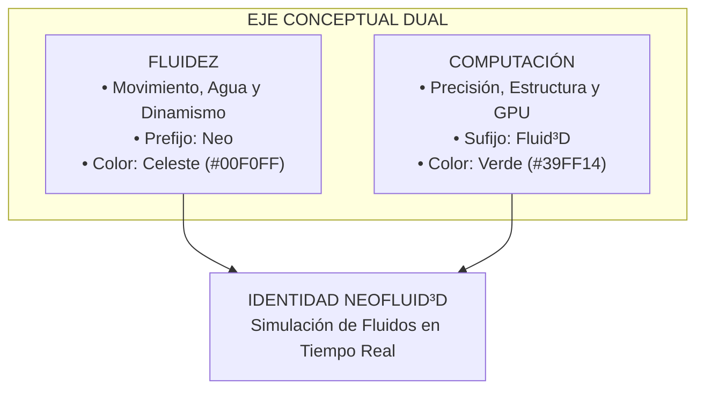
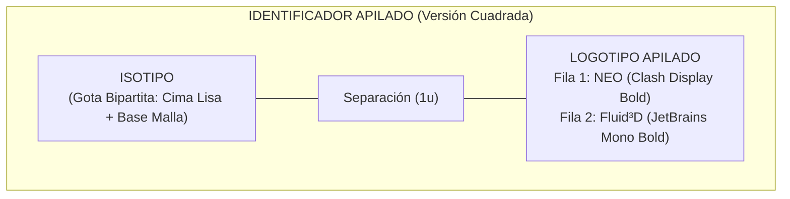
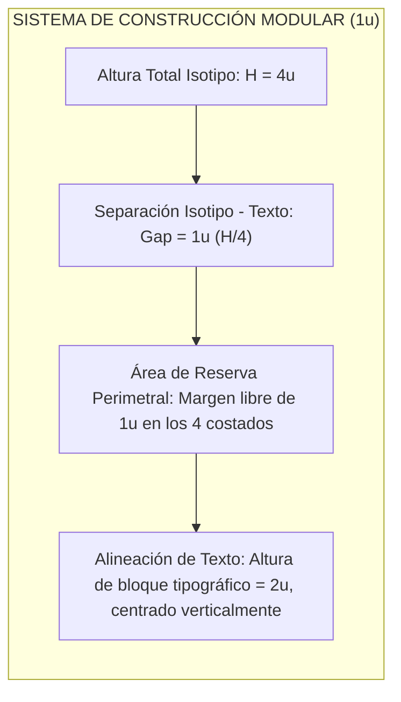
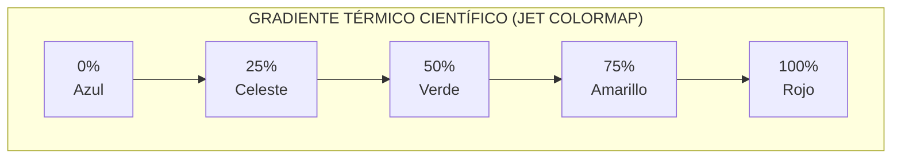
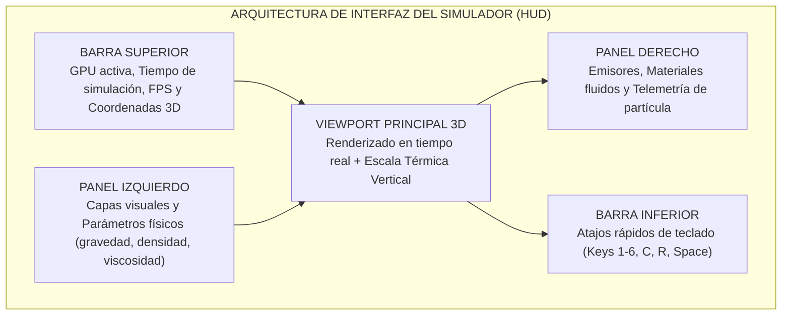

# NeoFluid3D — Entregable de Diseño
## Guía de Criterios y Evidencias para la Evaluación de Diseño
### Categoría Startup — Hackathon Nicaragua 2026 (Primera Etapa de Evaluación)

---

> **Proyecto:** NeoFluid3D  
> **Categoría:** Startup — Primera Etapa de Evaluación de Diseño  
> **Versión:** 2.0 (Identidad Visual & Sistema de Componentes)  
> **Fecha:** Agosto 2026  

---

# ÍNDICE GENERAL

* [1. PROPÓSITO Y ENFOQUE DEL ENTREGABLE](#1-propósito-y-enfoque-del-entregable)
* [BLOQUE 1: IDENTIDAD VISUAL Y CONSTRUCCIÓN DE MARCA](#bloque-1-identidad-visual-y-construcción-de-marca)
  * [1. Concepto y Dirección Visual](#1-concepto-y-dirección-visual)
  * [2. Identificador y Expresión Gráfica](#2-identificador-y-expresión-gráfica)
  * [3. Lenguaje Visual](#3-lenguaje-visual)
  * [4. Coherencia de Identidad](#4-coherencia-de-identidad)
  * [5. Documentación de la Identidad — Manual de Marca](#5-documentación-de-la-identidad--manual-de-marca)
* [BLOQUE 2: SISTEMA VISUAL Y COMPONENTES DE DISEÑO](#bloque-2-sistema-visual-y-componentes-de-diseño)
  * [6. Estructura Visual y Jerarquía](#6-estructura-visual-y-jerarquía)
  * [7. Componentes Visuales](#7-componentes-visuales)
  * [8. Reglas de Diseño](#8-reglas-de-diseño)
* [4. EVIDENCIAS DISPONIBLES (CHECKLIST OFICIAL)](#4-evidencias-disponibles-checklist-oficial)
* [5. SÍNTESIS DE EVALUACIÓN: ¿QUÉ DEBE DEMOSTRAR LA STARTUP?](#5-síntesis-de-evaluación-qué-debe-demostrar-la-startup)

---

# 1. PROPÓSITO Y ENFOQUE DEL ENTREGABLE

El presente documento recopila y estructura las evidencias de diseño desarrolladas para **NeoFluid3D**, dando respuesta a los criterios de evaluación de la categoría **Startup** en el marco del **Hackathon Nicaragua 2026**.

El diseño de NeoFluid3D se evalúa bajo 5 aspectos transversales:
1. **Coherencia:** Todos los elementos visuales responden al eje conceptual de marca (*Fluidez + Computación*).
2. **Consistencia:** Los elementos recurrentes mantienen una misma lógica visual en todos los puntos de contacto.
3. **Intencionalidad:** Cada decisión cromática, tipográfica y espacial responde a una función técnica y no a capricho estético.
4. **Sistematización:** Los elementos se organizan bajo reglas modulares reproducibles (escala de 8px, módulo 1u, paleta cerrada de 6 tokens).
5. **Aplicación:** Todo el sistema se encuentra aplicado activamente en el sitio web institucional y en el motor de simulación nativo.

---

# BLOQUE 1: IDENTIDAD VISUAL Y CONSTRUCCIÓN DE MARCA

---

## 1. Concepto y Dirección Visual

### A. Concepto de Identidad
**NeoFluid3D** es un motor de simulación hidrodinámica 3D en tiempo real acelerado en GPU para ingeniería, gemelos digitales y experiencias interactivas.

La identidad visual nace de la combinación de dos conceptos complementarios:
1. **La Fluidez:** Representa el agua, el movimiento orgánico y la dinámica de fluidos.
2. **La Computación:** Representa la precisión matemática, la estructura de cálculo y la tecnología de aceleración en GPU.

> 📷 **[IMAGEN: Moodboard y Dirección Visual — Concepto de Marca Fluidez + Computación]**

### B. Dirección Visual y Referencias
La personalidad de la marca se apoya en una estética técnica y moderna:
* Contrastes definidos sobre fondos oscuros (estilo estación de trabajo de ingeniería).
* Retículas que comunican precisión y orden visual.
* Acentos luminosos de color que dirigen la atención a los datos y controles clave.

### C. Cómo el Concepto se Traduce Visualmente
Cada decisión gráfica refuerza la dualidad Fluidez + Computación:

* **Isotipo:** La mitad superior de la gota es continua y lisa (fluido), mientras que la mitad inferior es una malla enrejada tridimensional (cómputo). El concepto central del proyecto queda sintetizado en un único símbolo.
* **Tipografía dual de marca:** *Clash Display Variable Bold* (sólida, de impacto) para *Neo* frente a *JetBrains Mono Bold* (monoespaciada, técnica) para *Fluid³D*: lo vanguardista y fluido frente al rigor computacional.
* **Colores primarios:** Celeste de Marca (`#00F0FF`) evoca agua en movimiento; Verde de Marca (`#39FF14`) evoca la señal luminosa de procesamiento activo en GPU.
* **Fondos y retículas:** El fondo Obsidiana Deep (`#070B0E`) con rejilla milimétrica sutil reproduce el entorno de trabajo del ingeniero frente a su herramienta de cálculo.

---

## 2. Identificador y Expresión Gráfica

Para el contexto de esta etapa de evaluación, se utiliza la **versión apilada / cuadrada**, diseñada para encajar armónicamente en cuadrículas de presentación, perfiles y aplicaciones compactas:

> 📷 **[IMAGEN: Identificador Gráfico Apilado Oficial]**  
> 

### A. Anatomía del Isotipo (La Gota Bipartita)
* **Sección Superior (Celeste de Marca `#00F0FF`):** Superficie lisa y cónica que evoca la tensión superficial y la continuidad física del fluido.
* **Sección Inferior (Verde de Marca `#39FF14`):** Estructura enrejada con tres anillos de latitud y líneas guía, representando la malla discreta de cálculo donde ocurre la simulación.

### B. Composición del Logotipo
* **Fila Superior:** `NEO` (Clash Display Variable Bold) en mayúsculas sólidas.
* **Fila Inferior:** `Fluid³D` (JetBrains Mono Bold), alineado en anchura visual con el bloque superior.
* **El detalle ³D:** Integra el superíndice `³` y la letra `D` sobre la misma línea base, generando un balance entre síntesis tipográfica y profundidad tridimensional (*flat-depth*).

---

## 3. Lenguaje Visual

### A. Paleta Cromática Oficial

| Categoría | Nombre Oficial | HEX | RGB | Rol y Aplicación en el Sistema |
|---|---|:---:|:---:|---|
| **Primario** | **Celeste de Marca** | `#00F0FF` | (0, 240, 255) | Prefijo *Neo*, dinamismo, masa continua de fluido y cima cónica de la gota. |
| **Primario** | **Verde de Marca** | `#39FF14` | (57, 255, 20) | Sufijo *Fluid³D*, malla discreta de cálculo GPU y base reticulada de la gota. |
| **Base** | **Obsidiana Deep** | `#070B0E` | (7, 11, 14) | Fondo base de alto contraste y entorno tridimensional de la aplicación. |
| **HUD** | **Titanio Técnico** | `#8FA6B2` | (143, 166, 178) | Telemetría, etiquetas analíticas, textos secundarios y metadatos. |
| **Secundario (CFD)** | **Azul Simulación** | `#3B82F6` | (59, 130, 246) | Campos de baja velocidad, régimen laminar y shaders de presión hidrodinámica. |
| **Secundario (CFD)** | **Naranja Térmico** | `#FF9100` | (255, 145, 0) | Turbulencia, campos de temperatura y zonas de alta energía cinética. |

> 📷 **[IMAGEN: Muestras de la Paleta Cromática Oficial con Tarjetas de Color y Valores HEX / RGB]**

### B. Tipografías Oficiales

| Familia Tipográfica | Peso / Variante | Aplicación en el Sistema |
|---|---|---|
| **1. Clash Display** | `Variable Bold` | Logotipo de Marca: Prefijo *"Neo"* |
| **2. JetBrains Mono** | `Bold (700)` / `Regular (400)` | Logotipo: Sufijo *"Fluid³D"*, datos técnicos, código y telemetría |
| **3. Oxanium** | `Medium (500)` | Títulos principales de sección e interfaz |
| **4. IBM Plex Sans SemiCondensed** | `Regular (400)` | Subtítulos, encabezados secundarios y métricas destacadas |
| **5. Inter** | `Regular (400)` | Texto corrido, párrafos de lectura, botones y elementos UI |

> 📷 **[IMAGEN: Espécimen Tipográfico Oficial mostrando Jerarquía de Títulos, Subtítulos, Texto y Código]**

### C. Recursos Gráficos
* **Mallas y Retículas:** Fondos sutiles cuadriculados que aportan un tono de ingeniería y orden métrico.
* **Gradientes Controlados:** Transición suave de Celeste a Verde para destacar botones principales y cabeceras interactivas.

---

## 4. Coherencia de Identidad

### A. Hilo Visual Entre los Puntos de Contacto
La identidad se aplica en cuatro contextos clave, manteniendo consistencia en todos ellos:

| Punto de Contacto | Isotipo Bipartito | Colores Primarios | Tipografía Dual | Retícula / Fondo Oscuro |
|---|:---:|:---:|:---:|:---:|
| **Sitio Web** | ✓ (navbar, footer, favicon) | ✓ (Celeste + Verde en títulos, botones, íconos) | ✓ (Oxanium + IBM Plex + Inter) | ✓ (fondo `#070B0E` con grid sutil) |
| **Simulador (Desktop)** | ✓ (splash, barra de título) | ✓ (HUD y escala térmica en Celeste/Verde) | ✓ (JetBrains Mono en telemetría) | ✓ (viewport oscuro con retícula 3D) |
| **Documentación & SDK** | ✓ (encabezado de páginas) | ✓ (acentos en bloques de código) | ✓ (JetBrains Mono en snippets) | ✓ (fondos de código oscuros) |
| **Material de Presentación** | ✓ (láminas y portadas) | ✓ (gradiente Celeste→Verde en headers) | ✓ (Oxanium + Inter) | ✓ (slides sobre fondo oscuro) |

### B. Por qué se Percibe como una Misma Marca
El reconocimiento se logra porque en cada contexto se repiten los mismos cuatro pilares:
1. **Mismo par cromático primario** (Celeste `#00F0FF` + Verde `#39FF14`) aplicado con la misma jerarquía.
2. **Mismo isotipo bipartito** reproducido en las proporciones oficiales.
3. **Misma combinación tipográfica** (display + monoespaciada) para separar lo expresivo de lo técnico.
4. **Mismo tratamiento de fondo** (superficie oscura `#070B0E` con retícula sutil) que unifica el tono visual.

> 📷 **[IMAGEN: Collage de Aplicaciones de Marca — Sitio Web, Simulador Desktop, Documentación SDK y Láminas de Presentación]**

---

## 5. Documentación de la Identidad — Manual de Marca

### A. Proporción y Área de Seguridad
* **Módulo Base (u):** La altura del isotipo se divide en 4 partes iguales (H = 4u).
* **Separación (gap):** La distancia entre el isotipo y el bloque de texto equivale a 1u (25% de la altura total).
* **Área de Reserva:** Se debe mantener un margen libre de al menos 1u alrededor de la marca para asegurar su legibilidad frente a otros elementos gráficos o bordes.

> 📷 **[IMAGEN: Blueprint Técnico del Imagotipo Apilado con Cotas Modulares (4u), Área de Reserva (1u) y Ejes de Construcción]**  
> 

### B. Tamaño Mínimo de Reproducción
* **Pantalla (Digital):** 16px para el isotipo solo (ej. favicon) y 32px de altura para el identificador completo.
* **Impresos:** 10mm de altura mínima.

### C. Criterios de Uso Correcto
* Mantener siempre la proporción original; no comprimir, estirar ni distorsionar.
* Utilizar sobre fondos de alto contraste (preferentemente oscuros `#070B0E`).
* No alterar la alineación horizontal de línea base entre `Neo` y `Fluid³D`.
* No sustituir las tipografías oficiales por fuentes genéricas.

---

# BLOQUE 2: SISTEMA VISUAL Y COMPONENTES DE DISEÑO

---

## 6. Estructura Visual y Jerarquía

La interfaz de usuario organiza la información en tres planos de lectura claros:
1. **Plano de Fondo (Base):** Color oscuro `#070B0E` con retícula sutil para descansar la vista y maximizar el contraste técnico.
2. **Plano de Contenido (Tarjetas y Paneles):** Superficies semitransparentes con bordes finos de 1px que agrupan controles y métricas.
3. **Plano de Acción (Botones y Acentos):** Elementos interactivos destacados en Celeste y Verde con efectos luminosos suaves.

---

## 7. Componentes Visuales

### A. Catálogo de Componentes UI

| Componente | Especificaciones Visuales |
|---|---|
| **Botón Primario** | Gradiente Celeste → Verde, texto oscuro de alto contraste, radio de borde de 6px. Al pasar el cursor incrementa su brillo sutilmente. |
| **Botón Secundario** | Fondo translúcido con borde Celeste de 1px y texto en color Celeste. |
| **Tarjetas de Datos (Paneles)** | Fondo oscuro translúcido, borde blanco al 9% de opacidad, radio de borde de 10px para organizar métricas y bloques temáticos. |
| **Etiquetas de Estado (Tags / Badges)** | Micro-píldoras tipográficas en JetBrains Mono con bordes de color para indicar modos de simulación y categorías técnicas. |
| **Campos de Entrada (Inputs)** | Cajas oscuras con borde neutro que se ilumina en Celeste al recibir el foco del usuario. |

### B. Estados y Variantes de Componentes
Cada componente interactivo contempla al menos tres estados visuales:
* **Reposo:** Apariencia base con bordes neutros y opacidad estándar.
* **Hover / Foco:** Incremento sutil de brillo o aparición del borde Celeste, indicando interactividad.
* **Activo / Seleccionado:** Acento sólido en Celeste o Verde según la categoría del componente, confirmando la acción.

> 📷 **[IMAGEN: UI Kit — Catálogo de Componentes (Botones, Tarjetas, Inputs, Badges) en Estados Reposo, Hover y Activo]**

### C. Iconografía Técnica (13 Íconos Vectoriales)
El sistema incluye una familia de **13 íconos vectoriales SVG**, diseñados con un trazo limpio y consistente de 2px con terminaciones redondeadas:

| Ícono | Color Asignado | Aplicación en el Sistema |
|---|:---:|---|
| **1. Zap** | Celeste (`#00F0FF`) | Alertas, notificaciones rápidas y eventos del motor |
| **2. Cpu** | Verde (`#39FF14`) | Procesamiento GPU y arquitectura de hardware |
| **3. RefreshCw** | Celeste (`#00F0FF`) | Reinicio de simulación y rotación de vista 3D |
| **4. Globe** | Verde (`#39FF14`) | Vista global del entorno de simulación |
| **5. Sliders** | Celeste (`#00F0FF`) | Panel de ajuste de variables físicas y constantes |
| **6. Copy** | Celeste (`#00F0FF`) | Copiado de bloques de código, shaders y comandos |
| **7. Clapperboard** | Verde (`#39FF14`) | Módulo de gemelos digitales e industria |
| **8. Wind** | Verde (`#39FF14`) | Dinámica de fluidos y pruebas aerodinámicas |
| **9. Gamepad2** | Celeste (`#00F0FF`) | Modos de interacción en realidad virtual (VR) |
| **10. Video** | Verde (`#39FF14`) | Exportación de secuencias y renderizado |
| **11. Gamepad** | Celeste (`#00F0FF`) | Experiencias y simulaciones en tiempo real |
| **12. Network** | Verde (`#39FF14`) | Conectividad, licencias empresariales y SDK |
| **13. Crosshair** | Celeste (`#00F0FF`) | Centrado y enfoque de cámara 3D |
| **14. Check** | Verde (`#39FF14`) | Confirmaciones de estado y parámetros validados |

> 📷 **[IMAGEN: Familia Completa de 13 Íconos Vectoriales SVG en Trazo 2px con Terminaciones Redondeadas]**

### D. Modos de Visualización del Fluido en el Simulador
El visor 3D permite alternar entre diferentes modos gráficos para analizar el comportamiento del fluido:

| Atajo | Modo de Fluido | Descripción Visual |
|:---:|---|---|
| `[1]` | **Partículas** | Visualización individual de partículas con sombreado esférico en GPU. |
| `[2]` | **Plexus** | Red topológica de líneas que muestra la vecindad e interacción física entre partículas. |
| `[3]` | **Malla Superficie** | Reconstrucción de superficie continua tipo líquido suave en tiempo real (Marching Cubes). |
| `[4]` | **Vectores** | Flechas tridimensionales que indican magnitud y dirección del flujo local. |
| `[5]` | **Líneas de Flujo** | Estelas cinéticas que dibujan la trayectoria de corriente del fluido en el espacio. |
| `[6]` | **Mapa CFD** | Coloreado térmico sobre la superficie del fluido según su velocidad local. |

> 📷 **[IMAGEN: Comparativa Visual de los 6 Modos de Renderizado de Fluido en el Visor 3D]**

### E. Variantes de Representación de Modelos 3D
Para los objetos u obstáculos dentro del entorno de simulación se contemplan diferentes estilos de renderizado:
* **Modo Sólido:** Aspecto opaco tipo modelo CAD para distinguir claramente los obstáculos físicos.
* **Modo Wireframe:** Malla alámbrica que permite observar la estructura de polígonos del modelo.
* **Modo Silueta / Ghost:** Contorno semitransparente que sirve de guía para ubicar emisores y objetos en pausa.
* **Modo Oculto:** Oculta el obstáculo para observar exclusivamente el fluido en movimiento libre.

> 📷 **[IMAGEN: Muestra de las 4 Variantes de Renderizado de Obstáculos 3D: Sólido, Wireframe, Silueta y Oculto]**

### F. Escala Térmica CFD (Gradiente Jet)
Para representar los rangos de velocidad en el software, se implementa la escala estándar **Jet**, ampliamente reconocida en la visualización científica y de dinámica de fluidos:

| Rango de Velocidad | Rango Porcentual | Color del Gradiente Jet | Significado Físico / Hidrodinámico |
|---|:---:|---|---|
| **Baja** | 0% – 25% | Azul (`#0000FF`) → Celeste (`#00F0FF`) | Fluido en reposo o régimen laminar lento |
| **Media** | 25% – 75% | Verde (`#00FF00`) → Amarillo (`#FFFF00`) | Velocidad nominal de flujo operativo |
| **Alta** | 75% – 100% | Naranja (`#FF9100`) → Rojo (`#FF0000`) | Zonas de aceleración máxima, turbulencia y vórtices |

Una **barra graduada vertical** en el panel lateral muestra en tiempo real los valores de velocidad en metros por segundo (m/s).

> 📷 **[IMAGEN: Barra Térmica Graduada Vertical de Escala Jet con Graduación en m/s e Histograma de Velocidades]**

### G. Interfaz de Control (HUD Técnico)
La interfaz del simulador organiza las herramientas de forma intuitiva:

* **Barra Superior:** Información general del sistema (nombre de GPU, tiempo de simulación transcurrido, FPS y coordenadas de cámara).
* **Panel Izquierdo:** Selección de capas visuales del fluido y ajuste de propiedades físicas (gravedad, densidad, viscosidad).
* **Panel Derecho:** Selector de emisor (cantidad de partículas), perfiles de fluidos (agua, aceite, etc.) y panel de telemetría para inspeccionar partículas individuales.
* **Barra Inferior:** Guía rápida de atajos de teclado para un manejo ágil del simulador.

> 📷 **[IMAGEN: Captura Completa del HUD del Simulador mostrando Barra Superior, Paneles Laterales y Viewport 3D]**

---

## 8. Reglas de Diseño

* **Espaciado y Escala Modular:** Espaciados consistentes basados en múltiplos de 8px (8, 16, 24, 32, 48px) para mantener balance en todas las vistas.
* **Bordes y Radios:** Radios de 6px para botones e inputs, y 10px para tarjetas y paneles de contenido.
* **Margen de Seguridad:** Separación holgada en los márgenes laterales (al menos 5.5rem en pantallas amplias) para evitar solapamientos con navegadores o menús flotantes.
* **Legibilidad y Contraste:** Altos contrastes de texto para garantizar una lectura cómoda tanto en web como en el visor del simulador.

### Lógica Visual Compartida Entre Componentes
Todos los componentes del sistema (botones, tarjetas, íconos, paneles del simulador y etiquetas) comparten un conjunto reducido de reglas que aseguran consistencia sin necesidad de rediseñar cada elemento:

1. **Misma base cromática:** Todo componente utiliza exclusivamente los 6 colores de la paleta oficial. No existen colores ad-hoc.
2. **Mismo trazo:** Los íconos vectoriales, los bordes de tarjetas y los separadores de paneles usan un grosor uniforme de 1–2px con terminaciones redondeadas.
3. **Misma escala de espaciado:** Tanto en la web como en el HUD del simulador, los márgenes y paddings siguen la escala de 8px.
4. **Misma jerarquía tipográfica:** Clash Display Variable Bold para el prefijo Neo, JetBrains Mono Bold para el sufijo Fluid³D, Oxanium Medium para títulos, IBM Plex Sans SemiCondensed Regular para subtítulos e Inter Regular para texto de lectura — sin excepciones.

---

# 4. EVIDENCIAS DISPONIBLES (CHECKLIST OFICIAL)

| Bloque | Criterio de Evaluación | Estado | Evidencia Documentada en el Entregable |
|---|---|:---:|---|
| **Bloque 1: Identidad Visual** | Concepto de marca | ✓ | Eje dual Fluidez + Computación con diagrama conceptual Mermaid (Sección 1). |
| **Bloque 1: Identidad Visual** | Identificador gráfico | ✓ | Identificador apilado oficial con anatomía de gota y proporciones tipográficas (Sección 2). |
| **Bloque 1: Identidad Visual** | Paleta cromática | ✓ | Tabla formal con 2 primarios, 2 secundarios CFD y 2 de soporte base/HUD (Sección 3A). |
| **Bloque 1: Identidad Visual** | Tipografías oficiales | ✓ | Tabla con jerarquía completa: Clash Display, JetBrains Mono, Oxanium, IBM Plex, Inter (Sección 3B). |
| **Bloque 1: Identidad Visual** | Coherencia entre contextos | ✓ | Matriz cruzada de 4 pilares en Web, Simulador, SDK y Presentaciones (Sección 4). |
| **Bloque 1: Manual de Marca** | Proporciones y área de reserva | ✓ | Sistema modular 4u, separación 1u, área de seguridad perimetral 1u (Sección 5A). |
| **Bloque 1: Manual de Marca** | Tamaños mínimos y reglas | ✓ | Límites de reproducción (16px / 32px / 10mm) y restricciones de uso (Sección 5B y 5C). |
| **Bloque 2: Sistema Visual** | Componentes de interfaz (UI) | ✓ | Catálogo de 5 componentes UI con especificaciones y 3 estados interactivos (Sección 7A y 7B). |
| **Bloque 2: Sistema Visual** | Iconografía técnica | ✓ | Familia completa de 13 íconos vectoriales SVG en trazo 2px con función asignada (Sección 7C). |
| **Bloque 2: Sistema Visual** | Modos de fluido y modelos 3D | ✓ | 6 modos de renderizado de fluido (Sección 7D) y 4 variantes de representación 3D (Sección 7E). |
| **Bloque 2: Sistema Visual** | Escala térmica científica | ✓ | Gradiente Jet (0% a 100%) con tabla de rangos, diagrama Mermaid y barra vertical (Sección 7F). |
| **Bloque 2: Sistema Visual** | Arquitectura HUD y espaciado | ✓ | Diagrama de 5 zonas del HUD (Sección 7G), escala de 8px y reglas de lógica compartida (Sección 8). |

---

# 5. SÍNTESIS DE EVALUACIÓN: ¿QUÉ DEBE DEMOSTRAR LA STARTUP?

### A. Sobre la Identidad
* **¿La startup tiene una identidad visual definida y coherente?**  
  **Sí.** La identidad parte de un eje conceptual dual claramente fundamentado (*Fluidez + Computación*, Sección 1). Cada elemento gráfico se deriva directamente de esta premisa: el isotipo bipartito fusiona la gota líquida con la malla de cálculo, el logotipo combina una fuente display de alto impacto (*Clash Display Bold*) con una tipografía monoespaciada de código (*JetBrains Mono Bold*), y los colores primarios representan el agua (**Celeste `#00F0FF`**) y la aceleración en GPU (**Verde `#39FF14`**). La matriz de coherencia (Sección 4) demuestra que estos cuatro pilares se mantienen idénticos en el sitio web, el simulador de escritorio, la documentación SDK y el material de presentación.

### B. Sobre la Documentación
* **¿La startup ha logrado documentar los criterios necesarios para utilizar esa identidad de manera consistente?**  
  **Sí.** El Manual de Marca (Sección 5) establece un sistema modular exacto basado en la unidad u (H = 4u, separación 1u, área de reserva perimetral de 1u), tamaños mínimos de reproducción (16px digital, 10mm impreso) y reglas explícitas de no deformación, contrastes oscuros obligatorios y alineación de línea base. Asimismo, las reglas de diseño (Sección 8) fijan la escala de espaciado en múltiplos de 8px y los radios de curvatura (6px y 10px).

### C. Sobre el Sistema
* **¿La startup ha comenzado a organizar elementos visuales reutilizables?**  
  **Sí.** El Bloque 2 organiza un ecosistema completo de elementos modulares:
  1. **UI Kit de componentes** (Sección 7A): botones primarios/secundarios, paneles de datos, inputs y badges.
  2. **Iconografía técnica** (Sección 7C): familia de 13 íconos vectoriales SVG estandarizados a 2px de trazo.
  3. **Sistema gráfico del simulador** (Secciones 7D, 7E, 7F y 7G): 6 modos de representación de fluido, 4 variantes de obstáculos 3D, escala térmica Jet (0% a 100%) y arquitectura modular del HUD en 5 zonas.

### D. Sobre los Componentes
* **¿Los elementos recurrentes mantienen una misma lógica visual?**  
  **Sí.** Todos los componentes interactivos comparten 3 estados estandarizados (*Reposo*, *Hover/Foco*, *Activo/Seleccionado*, Sección 7B). Además, la sección de **Lógica Visual Compartida** (Sección 8) define 4 reglas universales que aseguran que cualquier componente nuevo mantenga la misma expresión estética y funcional: paleta cerrada de 6 colores, grosor de trazo uniforme de 1–2px con terminaciones redondeadas, métrica estricta en múltiplos de 8px y jerarquía tipográfica invariable.

---

> **Conclusión General:**  
> NeoFluid3D cuenta con una identidad visual consolidada, respaldada por un sistema de componentes coherente y funcional, aplicado activamente en su sitio web y en su motor de simulación gráfica en tiempo real.
